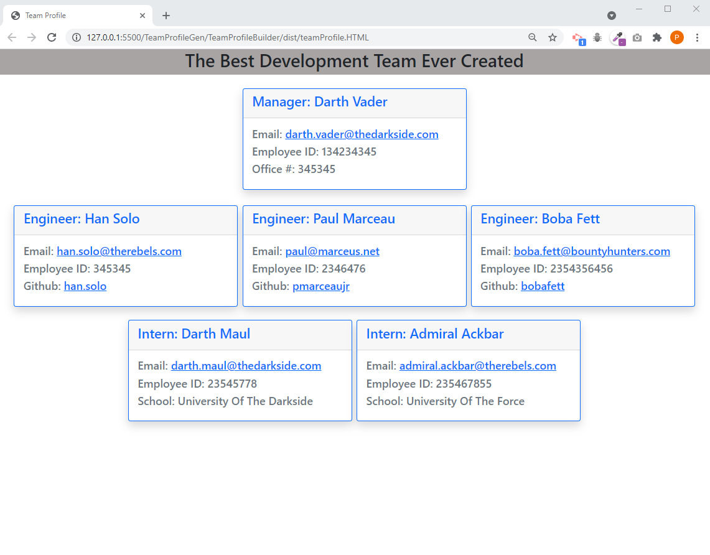
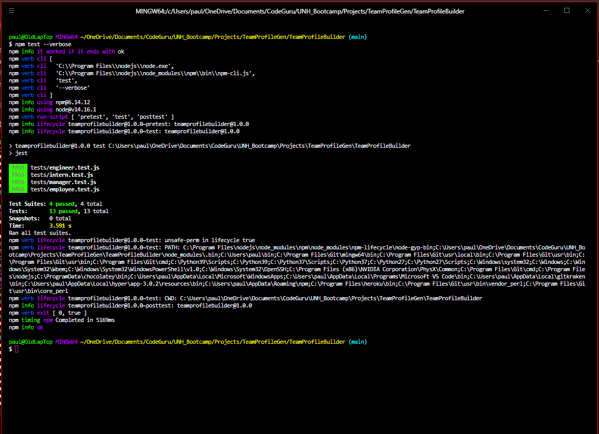

# **Team Profile Generator**

## **Description**

Build a Node.js command-line application that takes in information about employees on a software engineering team, then generates an HTML webpage that displays summaries for each person. Testing is key to making code maintainable, so you’ll also write a unit test for every part of your code and ensure that it passes each test.

## Table of Contents

- [User Story](#user-story)
- [Acceptance Criteria](#acceptance-criteria)
- [Installation](#installation)
- [Usage](#usage)
- [Required](#required)
- [Testing](#testing)
- [Questions And Support](#questions-and-support)
- [Contributors](#contributors)
- [Deployed Link](#deployed-link)
- [Media Links](#media-links)
- [License](#license)

---

## **User** **Story**

AS A manager I WANT to generate a webpage that displays my team's basic info SO THAT I have quick access to their emails and GitHub profiles

## **Acceptance** **Criteria**

GIVEN a command-line application that accepts user input WHEN I am prompted for my team members and their information THEN an HTML file is generated that displays a nicely formatted team roster based on user input WHEN I click on an email address in the HTML THEN my default email program opens and populates the TO field of the email with the address WHEN I click on the GitHub username THEN that GitHub profile opens in a new tab WHEN I start the application THEN I am prompted to enter the team manager’s name, employee ID, email address, and office number WHEN I enter the team manager’s name, employee ID, email address, and office number THEN I am presented with a menu with the option to add an engineer or an intern or to finish building my team WHEN I select the engineer option THEN I am prompted to enter the engineer’s name, ID, email, and GitHub username, and I am taken back to the menu WHEN I select the intern option THEN I am prompted to enter the intern’s name, ID, email, and school, and I am taken back to the menu WHEN I decide to finish building my team THEN I exit the application, and the HTML is generated

## **Installation**

+Install Node.js +Clone repository to your local machine +Run "npm install" to install all dependencies

## **Usage**

You will start the application by typing "node index.js" in the command line. The application will then proceed to ask you a series of questions regarding the team members. You can have as many team members as you need, but there can only be one manager per team. Once you have cycled through the questions, and selected "Done adding team Members" , the application will display all your answers and a non-formatted version of your new team profile. The final HTML version of the profile will also be written to the local directory.

## **Media** **Links**

## This is the final web page

## Screenshot Showing Test Results

## Full Demo video link:

https://drive.google.com/file/d/10o9qg3zHe1TLFbJhuRNyquACM3tiSPIF/view?usp=sharing

## **Required**

npm inquirer

## **Testing**

Testing was done using Jest. See attached screenshots and video for testing results

## **Questions** **And** **Support**

If you have any questions about the application or the repository, please open an [issue](https://github.com/pmarceaujr/TeamProfileBuilder/issues) or contact me via email at paul@marceaus.net.  
 You can find more of my work on my [GitHub](https://github.com/pmarceaujr).

## **Contributors**

No other contributors at this time

## **Deployed** **Link**

This is a node.js application and does not have a deployed web link

## **License**

This project is licensed under the [MIT License](https://choosealicense.com/licenses/mit).
